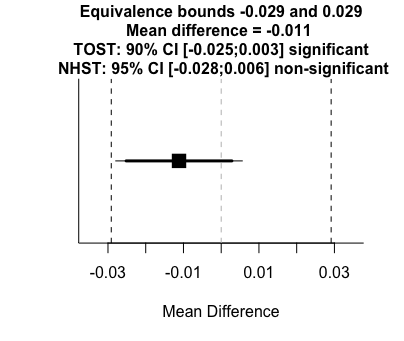
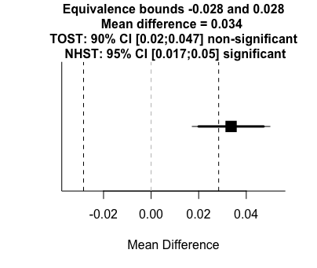

```{r setup, include=FALSE}
knitr::opts_chunk$set(echo = FALSE)
library(tidyverse)
```

**Name:** Kyle Parrish


**Affiliation:** Rutgers University


**Email:** kyle.parrish@rutgers.edu


**Paper Title:** The VOT productions of L3 French by Spanish-English bilinguals at first exposure. 


\newpage

# Abstract

The present study investigates bilinguals' first exposure to an L3 that they do not yet know in order to inform debates in L3 phonological acquisition. Specifically, participants who speak L1 Mexican Spanish and L2 English were given French words to repeat in order to examine whether the phonology of their first language or their second language plays a greater role in the starting point of L3 phonological acquisition. Previous studies have shown that, in the case of voice-onset time (VOT), L3 learners are primarily influenced by the L2 (Wrembel, 2010; Llama et al., 2010), or by hybrid values between the L1 and the L2 (Wrembel, 2011; Llama & Cardoso, 2018). One potential reason for the variation in findings may stem from small sample sizes in L3 research. Small sample size is associated with an increased risk of committing type 1 or type 2 errors (Brysbaert, 2020), and it is possible that the variation in the effects found in the literature to date could be explained by sampling error, in addition to varied methodology. To address these potential issues, the present study employs a higher sample size (n = 75) of absolute beginners and uses tests of equivalence (Lakens, 2017) in order to determine whether a group trend of the use L1 and/or L2 phonology exists in the pronunciation of L3 words at the first exposure.

  A total of 75 participants completed a shadowing task in which they repeated 26 stop-initial words in all three places of articulation, and elicited production tasks in Spanish and English. A comparison group of 50 Mexican Spanish monolinguals also completed the shadowing task. All stimuli were either one or two syllable words and were stressed on the first syllable. Words were presented in isolation and in a random order in language specific blocks. Participants also completed a language background questionnaire and the LexTALE lexical decision task (Lemhöfer & Broersma, 2011) in English as measure of proficiency.  

The data were analyzed using within-subjects tests of equivalence (Lakens, 2017) and paired t-tests. The results revealed that L3 relative VOT was practically equivalent to L2 VOT, and that L1 and L2 VOT were distinct. Additionally, a Bayesian multilevel regression model was used to analyze the data where relative VOT (Stölten et al., 2015) was modeled as a function of the fixed effect language. The results of the Bayesian regression model matched those of the frequentist tests and provided additional evidence that L3 words are produced using L2-like VOT at first exposure. The present study underscores the need for tests of equivalence and higher sample sizes in L3 research. Additionally, the results presented here suggest that L2 status effects may overcome the effects of typology, at least within the domain of phonology and at first exposure to an L3.  

\newpage

**Word List**
```{r, out.width="50%", fig.align='r=left'}
data.frame(English = c("tipping","teller","tacky","penny","pass",
                                 "parrot","kitten","kennel","cabbage"),
Spanish = c("tiro","tema","talla","quiso","queja", "cama", "piso","pena","pato"),
French = c("tir","terre","tasse","quitte","quelle","pile","pere","patte", "")) %>% 
  knitr::kable()
```

**Tests of Equivalence**
*Left, French/English test, right, French/Spanish test*
```{r, figures-side, fig.show="hold", out.width="50%"}


```


## References
\begingroup
\setlength{\parindent}{-0.5in}
\setlength{\leftskip}{0.5in}
\phantom{.} 
\textcolor{white}{\\} 
\vspace{-0.5in}
\begin{tiny}
Brysbaert, M. (2020). Power considerations in bilingualism research: Time to step up our game. Bilingualism: Language and Cognition, 1–6. 

Lakens, D. (2017). Equivalence Tests: A Practical Primer for t Tests, Correlations, and Meta-Analyses. Social Psychological and Personality Science, 8(4), 355–362. 

Lemhfer, K., \& Broersma, M. (2012). Introducing LexTALE: A quick and valid Lexical Test for Advanced Learners of English. Behavior Research Methods, 44(2), 325–343. 

Llama, R., \& Cardoso, W. (2018). Revisiting (Non-)Native Influence in VOT Production: Insights from Advanced L3 Spanish. Languages, 3(3), 30. 

Llama, R., Cardoso, W., \& Collins, L. (2010). The influence of language distance and language status on the acquisition of L3 phonology. International Journal of Multilingualism, 7(1), 39–57. 

St\"{o}lten, K., Abrahamsson, N., \& Hyltenstam, K. (2015). EFFECTS OF AGE AND SPEAKING RATE ON VOICE ONSET TIME: The Production of Voiceless Stops by Near-Native L2 Speakers. Studies in Second Language Acquisition, 37(1), 71–100.

Wrembel, M. (2011). Cross-linguistic Influence in Third Language Acquisition of Voice Onset Time. Proceedings of the 17th International Congress of Phonetic Sciences, 2157–2160.
\end{tiny}

\endgroup
